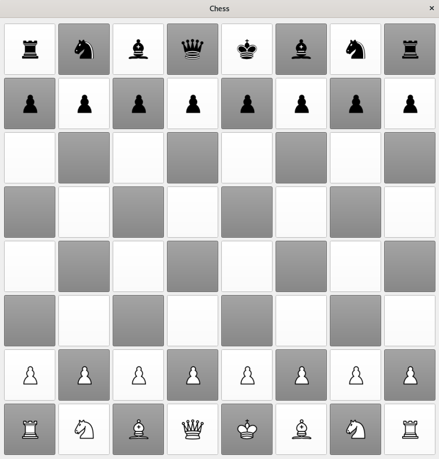

# Chess ♟️
This is a fully-working chess game, implemented in python with the Qt library for GUI elements. I programmed the chess board and each chess piece in separate classes. Each piece contains a method to generate a list of possible moves and attacks during each round. The pieces are tracked using a 2D array, and some functions to manage the GUI.  

### Current Features:
- Move highlighting
- Forced Turns (each side moves one piece at a time)
- Basic moves for each piece
### Features I'm working on:
- Checkmate Detection
- Special Case Rules
- AI Opponent
